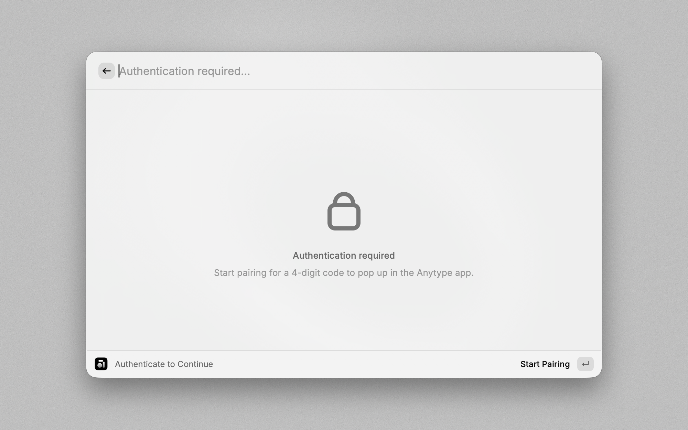
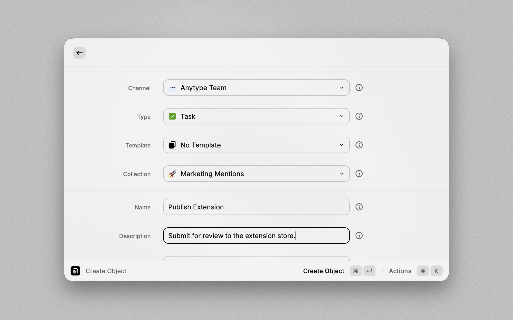
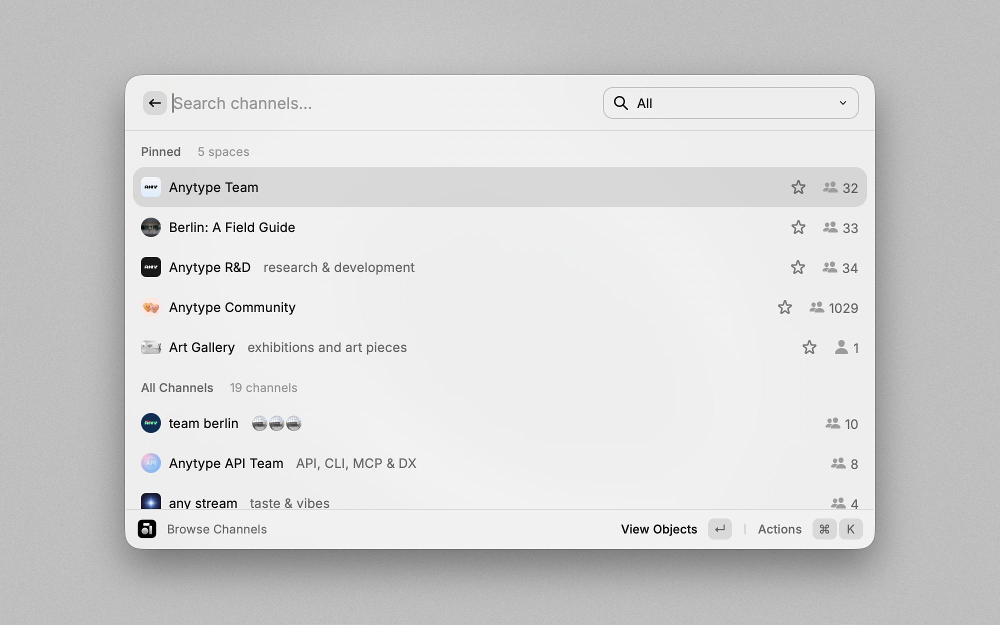
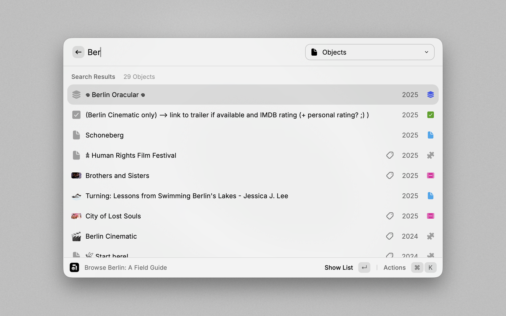
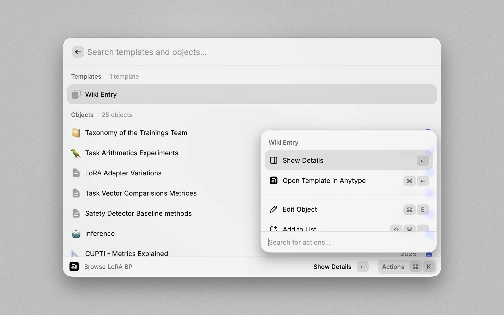
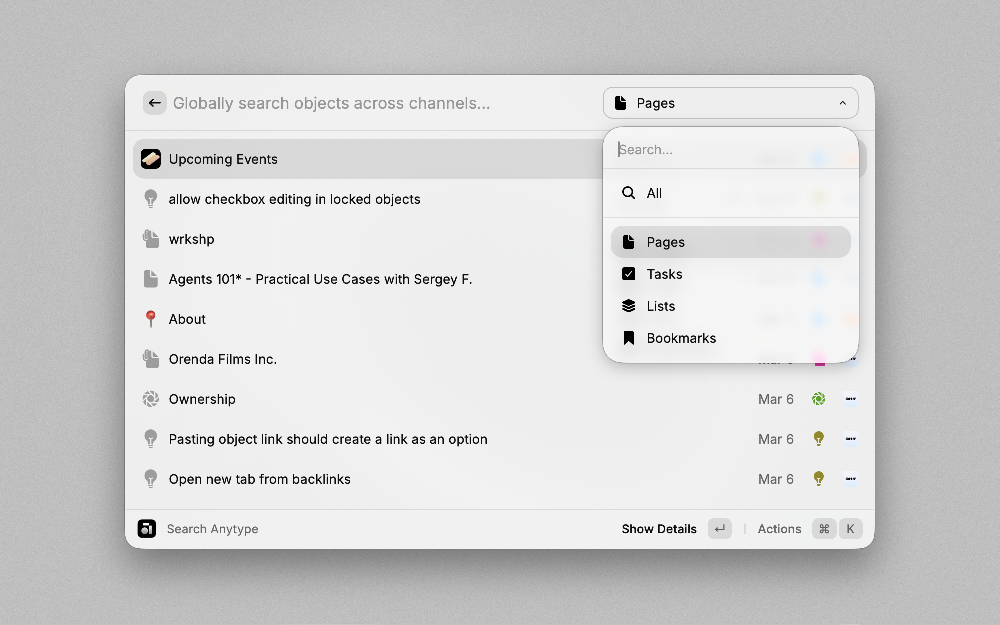
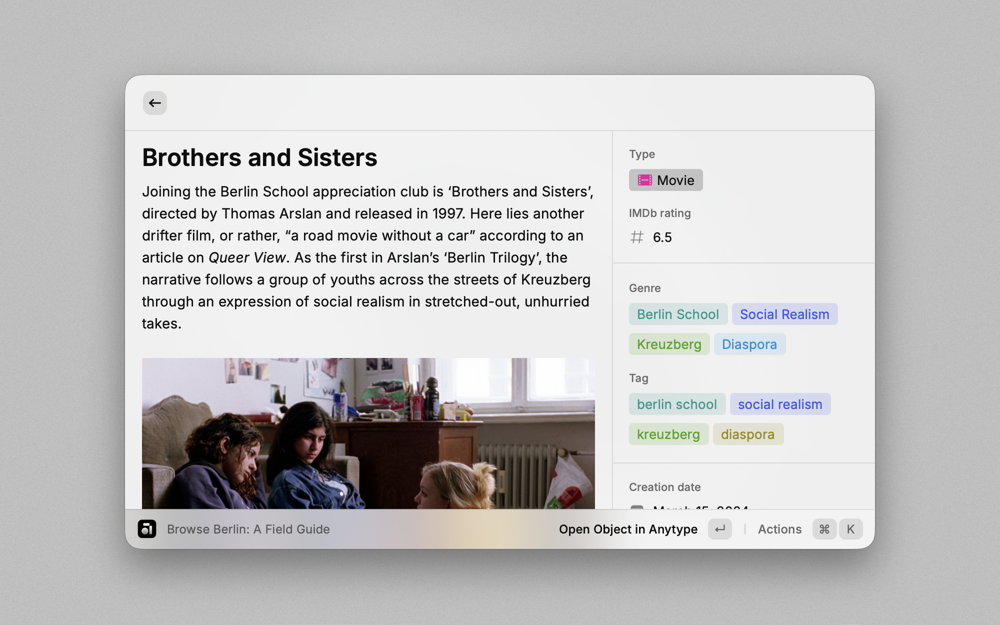

# Anytype for Raycast

Create, browse, search and edit within Anytype - right at your fingertips, anywhere on your Mac.

## Setup

To get started, grant the extension access to your account using the local pairing process. Follow these steps:

1. **Install the Extension**: Add the Anytype extension via the Raycast Store.
2. **Open Anytype Desktop**: Ensure the app is running and you are logged in.
3. **Run a Command**: Trigger any extension command.
4. **Authenticate**: When prompted, press <kbd>Enter</kbd> to start the pairing process.
5. **Enter the Code**: A popup in Anytype Desktop will display a 4-digit code. Input this code in the extension's `Code` field. Press <kbd><kbd>Command</kbd>+<kbd>Enter</kbd></kbd> to confirm.
6. **Confirmation**: Once successfully paired, the extension is ready to use.

## Commands

### Create Task

Create tasks directly with your saved channel and Task template. The command opens with the task name focused; only a name is required.

- **Compact layout** (default): select Task Type and Status in one row, City and Location in another, and Energy and Time in a GTD row. Choice chips include the original property name. Selecting a new value replaces a single-choice selection; multi-choice properties retain multiple values. Removing a chip clears only its property.
- **Core properties stay visible**: Tag, City, Location, Place, Task Type, Status, Energy, and Time appear on the main form when those properties exist. Date, number, and object-reference properties keep their native inputs. Options come from your existing Anytype properties.
- **Switch layout**: use Actions → Use Standard Layout / Use Compact Layout (`⌘⇧L`). The choice is remembered locally per account, and switching keeps the current draft.
- **Additional properties**: use Actions → Show Additional Properties (`⌘⇧M`) for the body, collection, and remaining custom fields.
- **Reference type filters**: Projects searches the actual Project type in the current channel; Place searches Place. Other object relations automatically match a unique type by key/name/plural name. Use Actions → Reference Type Filters to choose one or more allowed types per field, or explicitly allow all types. Missing or ambiguous matches never silently search everything. Filters are local to the account and channel; existing selections are preserved and marked when outside the filter. The API's property metadata does not expose the desktop's target-type restrictions, so these are extension-side filters.
- **Create**: `⌘↵` saves the task. `⌘⇧↵` creates it and starts another, keeping the project and collection while resetting task-specific values. Unchanged template properties are preserved, and new tasks start incomplete.

### Create Object

Create new objects in your spaces directly from Raycast.

- **Choose**: Specify the `Space` and `Type` of object (e.g., Bookmark, Note, Task).
- **Input**: Fill in details like the object name, description, or body text.
- **Save**: Press <kbd><kbd>Command</kbd>+<kbd>Enter</kbd></kbd> to save the object. It will immediately appear in your vault.

### Browse Spaces

Navigate through your spaces and explore their contents.

- **View**: A list of available spaces will appear.
- **Explore**: Select a space to view its objects, types, and members.
- **Interact**: Press <kbd>Enter</kbd> to view an object in Raycast or <kbd><kbd>Command</kbd>+<kbd>Enter</kbd></kbd> to open it in Anytype.

### Search Anytype

Perform a global search across all spaces in your vault.

- **Search**: Enter your search term in the search bar.
- **Filter**: Use the dropdown menu to filter results by type.
- **Interact**: Press <kbd>Enter</kbd> to view the object in Raycast or <kbd><kbd>Command</kbd>+<kbd>Enter</kbd></kbd> to open it in Anytype.

## Tips

Make the most of the Anytype extension with the following tips:

- **Open**: Use <kbd><kbd>Command</kbd>+<kbd>Enter</kbd></kbd> to instantly open the currently selected space or object in Anytype.
- **Refresh**: Manually refresh data with <kbd><kbd>Command</kbd>+<kbd>R</kbd></kbd>.
- **Deletion**: Quickly delete objects with <kbd><kbd>Ctrl</kbd>+<kbd>X</kbd></kbd>.
- **Drafts**: Leave the Object Creation command with unsaved changes, and the current state is automatically saved as a draft, allowing you to resume later.
- **Quicklinks**: Leverage even faster object creation:
  - Select the `Space` and `Type`.
  - Prefill object fields as needed.
  - Use the `Create Quicklink` option in the action menu and save with <kbd><kbd>Command</kbd>+<kbd>Enter</kbd></kbd>.
  - The Quicklink will appear in the root search under the specified name.

## Troubleshooting

### Error: API Not Reachable

- Ensure the Anytype Desktop app is running.
- Confirm you are logged into your vault.
- Verify both the extension and Anytype desktop app are up-to-date, with the app version being **v0.45.0** or later.

### Objects, Types or Spaces Not Displaying Completely

For performance reasons, the extension only fetches a limited amount of items at a time.

- Pagination is supported in lists to access additional items when scrolling down. However, the extension might refuse to paginate further if the available memory is exhausted.
- For dropdowns in `Create Object` command the limitation remains.
- The API limit can be adjusted in the extension settings - default is 50 items.

## Custom fork maintenance

See [LOCAL_CHANGES.md](LOCAL_CHANGES.md) for preserved custom features, reliability fixes, search filters, AI updates, and local build instructions.
